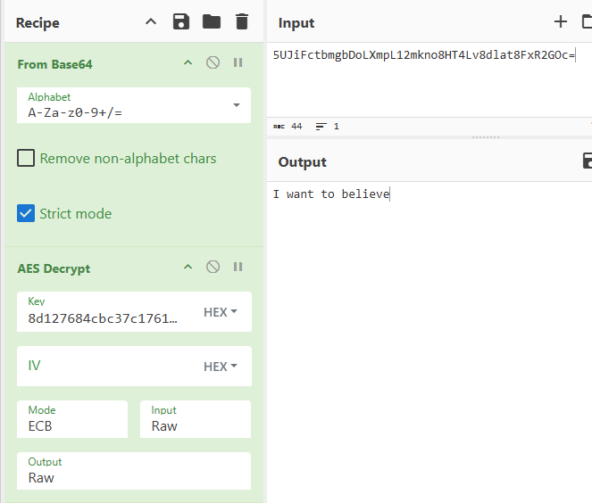

# 🛡️Guardsquare DevRel

Offer: 

* [https://www.linkedin.com/jobs/view/4160833895/](https://www.linkedin.com/jobs/view/4160833895/)   
* [https://job-boards.greenhouse.io/guardsquare/jobs/6575758](https://job-boards.greenhouse.io/guardsquare/jobs/6575758) 

# ProGuard open source tools: proguard-assemble

https://github.com/Guardsquare/proguard-assembler

## UnCrackable L1 challenge

Solve Android UnCrackable L1 with *proguard-assembler*

Download from here: https://mas.owasp.org/crackmes/

### 1.1 Setup *proguard-assembler*

Download [proguard-assembler](https://github.com/Guardsquare/proguard-assembler/tree/master) from github, unzip the project and enter in the folder
```sh
cd proguard-assembler-master
```
Use jdk 8 to compile proguard-assembler (my specific case using windows and scoop)
```sh
scoop reset openjdk8-redhat
```
Build the project 
```sh
./gradlew clean build
```
Get the generated `assembler.jar`
```
proguard-assembler-master\pga-cli\build\libs\assembler.jar
```

> [!TIP]
> `assembler.jar` is the tool. Only this file is needed to run *proguard-assembler*

### 1.2 Apk dex to jar conversion

*proguard-assembler* can't process an apk directly. It needs the `.jar` with all the `.class` inside to generate the `.jbc` files

1. Unzip `UnCrackable-Level1.apk`. It doesn't contain any `.jar` or `.class` files but it has `classes.dex`.
2. Download [dex2jar](https://github.com/pxb1988/dex2jar/releases) and unzip  
3. Run it against `classes.dex`  
```sh
./d2j-dex2jar.bat classes.dex
```

> [!TIP]
> This generates `classes-dex2jar.jar` with all the  `.class` files.

 Now it's ready to be used with *proguard-assembler*

### 1.3 Solve the challenge with *proguard-assembler*

```sh
java -jar ./assembler.jar ./classes-dex2jar.jar ./assembler-output2
```

This will decompile the app into `jbc` (Java ByteCode) files.

> [!IMPORTANT]  
> JBC is an internal format created by Guardsquare. The goal of JBC is to be a human-readable representation of the official Java Virtual Machine specification (JVMS). While the content inside the file represents standard Java Bytecode that follows the JVMS, the specific syntax and the .jbc extension are unique to the ProGuard Assembler.

Taking a look to those `jbc` files we can figure out what the app does:

**MainActivity.jbc**
```
public void verify(android.view.View) {
  ...
  invokestatic sg.vantagepoint.uncrackable1.a#boolean a(java.lang.String)
  ifeq label1
  aload_2
  ldc "Success!"
  invokevirtual android.app.AlertDialog#void setTitle(java.lang.CharSequence)
  ldc "This is the correct secret."
```

Here we can see that there's a comparison (`uncrackable1.a#boolean `) between 2 values

**uncrackable1.a.jbc**
```
public class sg.vantagepoint.uncrackable1.a extends java.lang.Object {

    public static boolean a(java.lang.String) {
            ldc "5UJiFctbmgbDoLXmpL12mkno8HT4Lv8dlat8FxR2GOc="
            iconst_0
            invokestatic android.util.Base64#byte[] decode(java.lang.String,int)
            astore_1
        label2:
            ldc "8d127684cbc37c17616d806cf50473cc`"
            invokestatic #byte8d127684cbc37c17616d806cf50473cc[] b(java.lang.String)
            aload_1
            invokestatic sg.vantagepoint.a.a#byte[] a(byte[],byte[])
            ...
```
Here we can find 2 suspicious strings and a method call with tem:
* `5UJiFctbmgbDoLXmpL12mkno8HT4Lv8dlat8FxR2GOc=`. A `String` that is decoded with `Base64` to `byte`
* `8d127684cbc37c17616d806cf50473cc` An Hexadecimal that is converted with `b()` to `byte`
* Method sg.vantagepoint.a.a that asks for 2 `byte`

**vantagepoint.a.jbc**
```
public class sg.vantagepoint.a.a extends java.lang.Object {

    public static byte[] a(byte[], byte[]) {
            new javax.crypto.spec.SecretKeySpec
            dup
            aload_0
            ldc "AES/ECB/PKCS7Padding"
            invokespecial javax.crypto.spec.SecretKeySpec#void <init>(byte[],java.lang.String)
            astore_0
            ldc "AES"
            invokestatic javax.crypto.Cipher#javax.crypto.Cipher getInstance(java.lang.String)
```

Here's the dought 🍪!
This method is using `AES` encryption with `ECB` mode and `PKCS7Padding`. The first parameter is the key and the second parameter is the data to decrypt.

We can conclude that:
* Password to decrypt: `5UJiFctbmgbDoLXmpL12mkno8HT4Lv8dlat8FxR2GOc=` converted to `byte` with `Base64` decoding
* AES key: `8d127684cbc37c17616d806cf50473cc` converted to `byte` from Hexadecimal
* Decryption method: `AES/ECB/PKCS7Padding`

We can go to [CyberChef](https://gchq.github.io/CyberChef/#recipe=From_Base64('A-Za-z0-9%2B/%3D',false,true)AES_Decrypt(%7B'option':'Hex','string':'8d127684cbc37c17616d806cf50473cc'%7D,%7B'option':'Hex','string':''%7D,'ECB','Raw','Raw',%7B'option':'Hex','string':''%7D,%7B'option':'Hex','string':''%7D)&input=NVVKaUZjdGJtZ2JEb0xYbXBMMTJta25vOEhUNEx2OGRsYXQ4RnhSMkdPYz0) and do the decryption:



### 1.4 Why not use javap?

Why all this hustle? We could have used `javap` to decompile the `.class` files directly

```sh
javap -c -p -v ./MainActivity.class > MainActivity.txt
```

**javap output**
```
public void verify(android.view.View);
  descriptor: (Landroid/view/View;)V
  flags: (0x0001) ACC_PUBLIC
  Code:
    stack=6, locals=3, args_size=2
        0: aload_0
        1: ldc           #89                 // int 2130837505
        3: invokevirtual #93                 // Method findViewById:(I)Landroid/view/View;
        6: checkcast     #95                 // class android/widget/EditText
        9: invokevirtual #99                 // Method android/widget/EditText.getText:()Landroid/text/Editable;
      12: invokevirtual #105                // Method java/lang/Object.toString:()Ljava/lang/String;
      15: astore_1
```
**jbc**
```
public void verify(android.view.View) {
    aload_0
    ldc 2130837505
    invokevirtual #android.view.View findViewById(int)
    checkcast android.widget.EditText
    invokevirtual android.widget.EditText#android.text.Editable getText()
    invokevirtual java.lang.Object#java.lang.String toString()
    astore_1
```

We'll see why later...

### 1.5 Modify the app with proguard-assembler

* Take the output folder from proguard-assembler generated in the step before and modify `MainActivity.jbc` to skip the verification `ifeq label1` and always shows "Success!"
```jbc
version 1.6;
public class sg.vantagepoint.uncrackable1.MainActivity extends android.app.Activity [
    ...
    public void verify(android.view.View) {
        ...
        invokestatic sg.vantagepoint.uncrackable1.a#boolean a(java.lang.String)
        // ifeq label1 <-- skip check
        aload_2
        ldc "Success!"
        ...  
```
* Download an `android.jar` from here: https://github.com/Sable/android-platforms 
* Rebuild the .jar with **proguard-assembler**
```sh
java -jar ./assembler.jar ./android.jar ./UnCrackable-Level1-patched ./UnCrackable-Level1-patched.jar
```
* Build the dex file with dex-tools
```sh
 C:\...\Apps\dex-tools-v2.4\d2j-jar2dex.bat ./UnCrackable-Level1-patched.jar
```
It produces `UnCrackable-Level1-patched-jar2dex.dex`
* Rename `UnCrackable-Level1-patched-jar2dex.dex` to `classes.dex` and drag it into `UnCrackable-Level1-patched.apk`.
* Sign the apk with [uber-apk-signer](https://github.com/patrickfav/uber-apk-signer)
```sh
java -jar uber-apk-signer-1.3.0.jar --apks UnCrackable-Level1-patched.apk
```
* Install the app

### 1.6 Why not use javap? II


### 1.7 How to fix this

* String Encryption (DexGuard/ProGuard): This would encrypt the key itself and only decrypt it in memory for a split second when needed. In your .jbc file, you wouldn't see 8d12..., you would see a scrambled mess that only unscrambles at runtime.

* Android Keystore: Instead of putting the key in the code, the app should generate a key inside the phone's dedicated security chip (the TEE - Trusted Execution Environment). The code never actually "sees" the key; it just asks the chip to "please decrypt this for me."

* Native Code (C/C++): Moving the key into a .so file (JNI) makes it slightly harder to find than in a standard .java or .jbc file, though a determined hacker can still find it using tools like Ghidra.

### 1.8 Conclusion

The goal of this challenge is to showcase what `proguard-assembler` is capable to do
* It can dissasemble `.class` files into accurate but readable `jbc` files
* It can reassemble modified `jbc` files back into valid `.class` files
* `jbc` files are human-readable representation of the official Java Virtual Machine specification:
  * It's designed to be a 1:1 human-readable map of the ProGuard Core library
  * Can represent every single nuance of a .class file—including complex attributes and stack map frames—without the "baggage" or limitations of older community tools.
  * As specialized in code hardening, they need a custom "assembly language" to write test cases for new obfuscation techniques.
* An engineer can use `proguard-assembler` to  quickly analyze and patch a compiled Java application. For example create a "minimal reproducible case" of a .class that is not properly obfuscated by Proguard/R8.
* `proguard-assembler` can be integrated into another tool as a library. It's used internally into `proguard-code` to read and write bytecode. Probably Dexguard uses it too.
* Of course, `proguard-assembler` is not the best tool to solve this challenge.
  * For understanding the code, `jadx` converts `apk` into `java` code. But it can be broken by obfuscation techniques like Control Flow Flattening. Meanwhile, `proguard-assembler` generated `jbc` files are 1:1 representation of what the phone executes. 
  * For patching the apk we could have used `apktool + smali`.

# ☄️ Other Ideas for devrel portfolio

* Hack with Apktool + Smali
* Hack with Frida
* Hack with Ghidra / IDA Pro
  
## ❌ Discarded ideas:

**Hacking a vanilla APK vs Proguard APK:** 

* Find an open source android app. compile it to APK and then do reverse code hacking with jadx Do the same but now use proguard and explain differences in a video.  
* **❌ Problem:** Nobody uses proguard anymore, now Android provides a built-in tool called **R8** that does the same

**Dexguard tutorial**

* Since R8 became a thing now Guardsquare main product is Dexguard. Investigate and make a video about it  
* **❌ Problem:** It’s paid 💵 and expensive.

**Using AppSweep with a hackable app:**

* Hack OWASP MASTG [Android UnCrackable L](https://mas.owasp.org/crackmes/Android#android-uncrackable-l1) and solve the problem. Then use AppSweep with the apk and check if it finds the issue. Make a video about that  
* **❌ Problem:**It’s paid 💵and expensive. Mailed them to ask for a trial version but they said no.

## 📽️ Relevant videos

Proguard explanations:

* [https://www.youtube.com/watch?v=q4HQ0H-IQSU](https://www.youtube.com/watch?v=q4HQ0H-IQSU)   
* [https://www.youtube.com/watch?v=F9ymcWoDEtc](https://www.youtube.com/watch?v=F9ymcWoDEtc)   
* [https://www.youtube.com/watch?v=M0fMzgBcACY](https://www.youtube.com/watch?v=M0fMzgBcACY)   
* [https://youtu.be/x9T5EYE-QWQ?si=9e4tkuQKrWsxqTpx](https://youtu.be/x9T5EYE-QWQ?si=9e4tkuQKrWsxqTpx)   
* [https://www.youtube.com/watch?v=DZHn17qg5\_Y](https://www.youtube.com/watch?v=DZHn17qg5_Y)   
* [https://www.youtube.com/watch?v=vUBI-L1602s](https://www.youtube.com/watch?v=vUBI-L1602s) 
* [https://www.youtube.com/watch?v=bgpyuuzMlo0](https://www.youtube.com/watch?v=bgpyuuzMlo0)

Hack APK:

* [https://www.youtube.com/watch?v=7kKl3nokZso](https://www.youtube.com/watch?v=7kKl3nokZso)   
* **Jadx** [https://www.youtube.com/watch?v=QlpDMmfOUmM](https://www.youtube.com/watch?v=QlpDMmfOUmM) 
* Hacking Block Blast: https://www.youtube.com/watch?v=y4tMta9w6o0

JADX

* Good video:
  * [https://www.youtube.com/watch?v=F7CoOjjlR9U](https://www.youtube.com/watch?v=F7CoOjjlR9U)
* Bad videos:
  * [https://www.youtube.com/watch?v=FvJVtPfEJM4](https://www.youtube.com/watch?v=FvJVtPfEJM4)   
  * [https://www.youtube.com/watch?v=R3\_KUP02mXk](https://www.youtube.com/watch?v=R3_KUP02mXk)   
  * [https://www.youtube.com/watch?v=P6rNPkM2DdY](https://www.youtube.com/watch?v=P6rNPkM2DdY)   
  * [https://www.youtube.com/watch?v=9VjkPuzSJNo](https://www.youtube.com/watch?v=9VjkPuzSJNo)   
  * [https://www.youtube.com/watch?v=xRQVljerl0A](https://www.youtube.com/watch?v=xRQVljerl0A)


# 🎓 What I learned

##  Intermediate Representation, or IR

modern compilers like **Clang/LLVM** actually use a "temporary bytecode" internally during the building process.  
* **Front-End (Clang):** Turns your C++ into **LLVM Bitcode** (Intermediate Representation)
* **Optimizer:** Polishes that Bitcode to make it fast.  
* **Back-End:** Finally turns that Bitcode into the **Machine Code** (.exe or ELF).  
* **Crucially:** Usually, the developer "throws away" the Bitcode and only ships the Machine Code. Tools like **LibEBC** are for cases where the developer *chose* to embed that "recipe" inside the binary (common in Apple's ecosystem).

## Embedded Bitcode (EBC):

When developers compile code for iOS (or sometimes Android native libraries), they don't always just produce the final machine code (the binary the phone runs). They can also embed LLVM Bitcode.  
* Bitcode is an intermediate representation (**IR**)—it's halfway between source code and machine code.  
* The Apple Use Case: Apple asks developers to upload Bitcode to the App Store so that Apple can re-compile and optimize the app for new iPhones without the developer needing to upload a new version.

## Scoop 

handle different sofrtware versions in Windows. Useful for jdk versions
  * Install: 
```sh
iwr -useb get.scoop.sh | iex

scoop bucket add java   
scoop install openjdk8-redhat   
scoop install openjdk25  
```
  * Usage: 
```sh
scoop reset openjdk8-redhat
scoop reset openjdk25
```

## JADX

This converts `apk` --> `java` code

https://github.com/skylot/jadx
A Dex to Java decompiler. Produces Java source code from Android Dex and Apk files 

### Solve UnCrackable with JADX

We are going to convert the `apk` into readable `java` code

* Open the apk with JADX: https://github.com/skylot/jadx
* Show `MainActivity` and `a` classes and extract the relevant code
* Create new project with relevant classes and generate the password
* Test the password in the phone

## ProGuard Assembler

This converts  `.class` (could be a `jar` with multiple `.class` files) --> `jbc` and the opposite

https://github.com/Guardsquare/proguard-assembler
The disassembler can do 2 different things:
* take `class` files and convert them to readable `jbc` (Java ByteCode) files, following the [ProGuard Assembly Language specification](https://github.com/Guardsquare/proguard-assembler/blob/master/docs/md/specification.md).
* take readable `jbc` files and convert them to `class` files.

## JADX vs ProGuard Assembler

Decompilers like JADX are **guessing**. They try to reconstruct Java from bytecode, but if the code is heavily obfuscated (using techniques like _Control Flow Flattening_), JADX often fails, shows "/* error */", or produces misleading code
- **JADX:** A high-level interpretation (can be wrong) but if succeeds it produces `.java` human readable files
- **Assembler (.jbc):** A 1:1 representation of what the phone actually executes. It cannot be "broken" by obfuscation because it's just a list of raw instructions. But it's less human readable.

## classes.dex

While standard Java compiles into .class files, Android uses its own optimized format for it's virtuakl (bytecode for the Dalvik or ART runtime).

## dex2jar

https://github.com/pxb1988/dex2jar/wiki/Faq

Tool for converting Android's `.dex` format to Java's `.class` forma

## Decomplie a .class to bytecode with javap

```sh
javap -c -classpath ./UnCrackable-Level1-classes-dex2jar.jar sg.vantagepoint.uncrackable1.MainActivity > MainActivity.jbc
```

> [!IMPORTANT]  
> TODO: Explain differences with proguard assembler: "Here is the breakdown of why the ProGuard Assembler output is "better" for your specific hacking and reconstruction goal..."


## Apktool + Smali

The Industry Standard for Patching.

If a hacker wanted to do exactly what you are doing—rebuild and resign the APK—they would almost certainly use Apktool.

How it works: Apktool decompiles the APK into Smali files. Smali is the "standard" assembly language for Android's Dalvik/ART virtual machine.

Why it's preferred: It's universal. Every Android app has Smali, but not every app was built using ProGuard in a way that makes JBC (Java Bytecode) extraction easy. Most "cracked" apps you find on the internet were made by editing Smali code.

The Workflow: Apktool Decompile -> Edit .smali files -> Apktool Build -> uber-apk-signer.

## Frida

The Professional "Surgical" Tool.

A professional "Red Team" hacker often doesn't even bother rebuilding the APK. They use Frida, which is a dynamic instrumentation toolkit.

The "Magic" of Frida: Instead of changing the code on disk, Frida "injects" JavaScript into the app while it's running on the phone.

The Hack: A hacker would write 5 lines of JavaScript to say: "Whenever the method sg.vantagepoint.a.c.a() is called, don't actually run it—just return false (Not Rooted)."

Why it's better: It bypasses Signature Verification. Since the hacker never modified the APK file itself, the app's internal security checks won't notice that anything has changed.

## Ghidra / IDA Pro

The "Heavyweight" Analysis.

For apps with Native Code (.so files written in C++), hackers use these $10,000+ industry-standard tools (though Ghidra is free from the NSA). These are used when the "Secret Key" isn't in Java, but hidden deep in the machine code of the phone's processor.

## Uber APK Signer

https://github.com/patrickfav/uber-apk-signer

A tool that helps to sign, zip aligning and verifying APKs.

## JBC

It's an internal format created by Guardsquare. While the content inside the file represents standard Java Bytecode that follows the official Java Virtual Machine Specification (JVMS), the specific syntax and the .jbc extension are unique to the ProGuard Assembler.


# 🎬 Script of devrel video: Modifying Java ByteCode with ProGuard Assembler

## 1. Presentation

Hello everyone, 

I'm **PabloDevRel** and today we are going to discover **ProGuard Assembler**. A **powerful** tool developed by **Guardsquare** to read and modify the bytecode of Java applications.

## 2. Guardsquare

Guarsquare is a leading company in mobile app security.

They provide tools and services to protect mobile applications:

> Opens proguard website and show the products

Such as Dexguard, ixGuard for Android and iOS. AppSweep that performs security analysis of mobile apps. And the famous open source **ProGuard**: a Java shrinker, optimizer, obfuscator that it's a must in the Android development world.

If we take a look to the [GitHub page](https://github.com/Guardsquare)

> Opens proguard-assembler github page

We can find next to **ProGuard**, **Proguard Assembler**, the tool we will explore today.
 
## 3. proguard-assembler setup

We find this tool in GitHub as a gradle project. Let's download it

> Download it, unzip it and enter in the folder

No we are ready to build it

> Do `./gradlew clean build` and go to `pga-cli/build/libs/` folder to get the `assembler.jar` file.

This `assembler.jar` is the tool. Only this file is needed to run **proguard-assembler**. I will attach it to the video description to make it easier for you.

## 4. UnCrackable L1 challenge

We are going to use **proguard-assembler** to solve the famous **UnCrackable L1 challenge** from OWASP MASTG.

> Opens OWASP MASTG website and download the challenge
> Open Memu to show the apk

This app asks for a secret password to show a success message. If we input a wrong password it shows an error message.

## 5. Apk dex to jar conversion

**proguard-assembler** can't process an apk directly. It needs the `.jar` with all the `.class` inside to generate the `.jbc` files.

So first we unzip the apk to get `classes.dex`
Then we use **dex2jar** to convert `classes.dex` into `classes-dex2jar.jar` with all the `.class` files inside.
Now it's ready to be used with **proguard-assembler**

## 6. Solve the challenge with proguard-assembler


